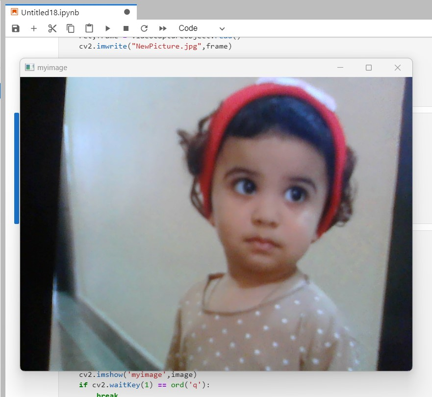
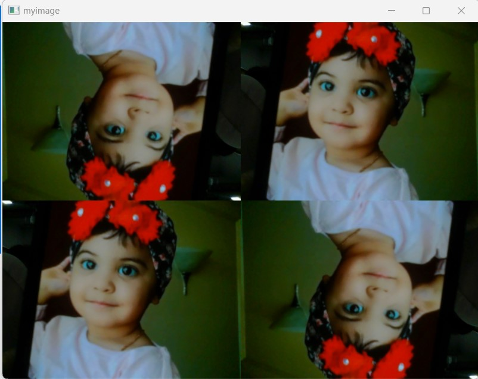

# Image-Acquisition-from-Web-Camera
## Aim
 
Aim:
 
To write a python program using OpenCV to capture the image from the web camera and do the following image manipulations.
i) Write the frame as JPG 
ii) Display the video 
iii) Display the video by resizing the window
iv) Rotate and display the video

## Software Used
Anaconda - Python 3.7
## Algorithm
### Step 1:

Import cv2 and capture the video using cv2.VideoCapture(0).
### Step 2:
Write the captured image using cv2.imwrite("NewPicture.jpg",frame).

### Step 3:
Resize the image using cv2.resize(frame, (0,0), fx = 0.5, fy=0.5).

### Step 4:
Display the image until the loop gets over.

### Step 5:
Rotate the image using cv2.rotate(smaller_frame,cv2.cv2.ROTATE_180).

## Program:
``` Python
### Developed By: mohamed aseem p
### Register No: 212221230063

## i) Write the frame as JPG file

import cv2
videoCaptureObject = cv2.VideoCapture(0)

while (True):
    ret,frame = videoCaptureObject.read()
    cv2.imwrite("NewPicture.jpg",frame)
    
    result = False
videoCaptureObject.release()
cv2.DestroyAllWindows()


## ii) Display the video

import cv2
videoCaptureObject = cv2.VideoCapture(0)

while(True):
    ret,frame = videoCaptureObject.read()
    cv2.imshow('myimage',frame)
    if cv2.waitKey(1) == ord('q'):
        break
videoCaptureObject.release()
cv2.destroyAllWindows()
    


## iii) Display the video by resizing the window

import cv2
import numpy as np
cap  = cv2.VideoCapture(0)
while True:
    ret,frame = cap.read()
    width = int(cap.get(3))
    height = int(cap.get(4))
    image = np.zeros(frame.shape, np.uint8)
    small_frame = cv2.resize(frame,(0,0),fx =0.5, fy = 0.5)
    image[:height//2, :width//2]=small_frame
    image[height//2:, :width//2]=small_frame
    image[:height//2, width//2:]=small_frame
    image[height//2:, width//2:]=small_frame
    cv2.imshow('myimage',image)
    if cv2.waitKey(1) == ord('q'):
        break
cap.release()
cv2.destroyAllWindows()


## iv) Rotate and display the video

import cv2
import numpy as np
cap  = cv2.VideoCapture(0)
while True:
    ret,frame = cap.read()
    width = int(cap.get(3))
    height = int(cap.get(4))
    image = np.zeros(frame.shape, np.uint8)
    small_frame = cv2.resize(frame,(0,0),fx =0.5, fy = 0.5)
    image[:height//2, :width//2]=cv2.rotate(small_frame,cv2.ROTATE_180)
    image[height//2:, :width//2]=small_frame
    image[:height//2, width//2:]=small_frame
    image[height//2:, width//2:]=cv2.rotate(small_frame,cv2.ROTATE_180)
    cv2.imshow('myimage',image)
    if cv2.waitKey(1) == ord('q'):
        break
cap.release()
cv2.destroyAllWindows()


```
## Output

### i) Write the frame as JPG image
</br>


</br>


### ii) Display the video
</br>


</br>


### iii) Display the video by resizing the window
</br>


</br>


### iv) Rotate and display the video
</br>



</br>


## Result:
Thus the image is accessed from webcamera and displayed using openCV.
